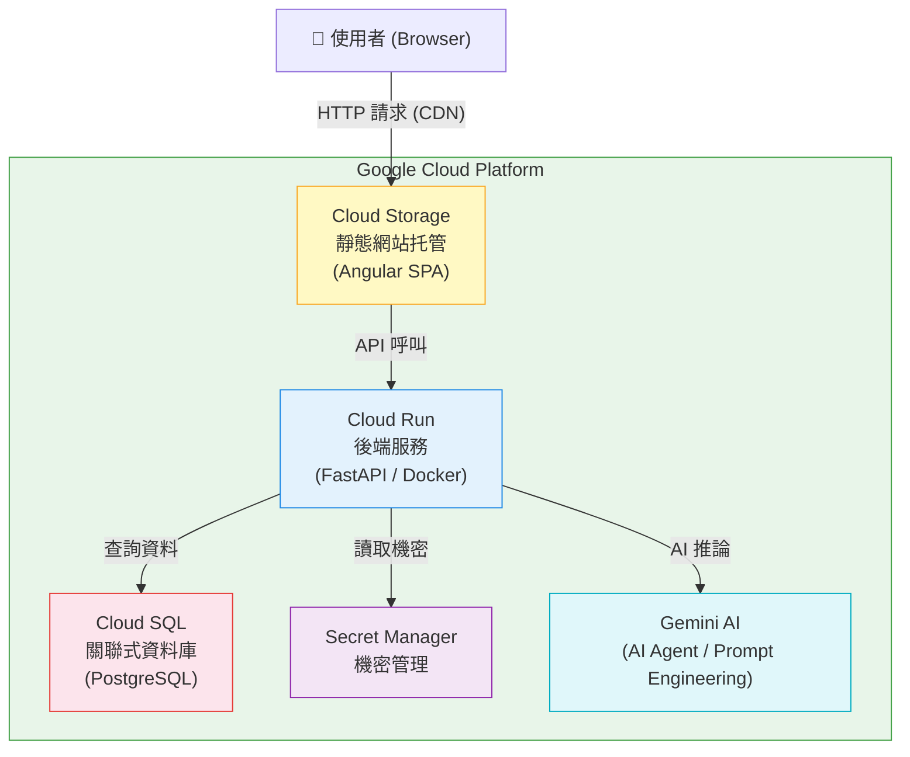

# AWS 證照刷題器

> 考照不再靠佛系，AI幫你抓漏補強

---

## 一、專案概覽

本專案分為三大主軸：

1. **AWS 雲端從業人員（Certified Cloud Practitioner）** — 雲端基礎知識與認證準備
2. **AI 專案** — 以 Prompt Engineering 與 AI Agent 驅動的智能功能
3. **GCP 架構 & Demo** — 以 Google Cloud Platform 建構的完整全端系統

---

## 二、系統架構圖

### 架構說明

使用者透過瀏覽器存取部署於 **Cloud Storage** 的 Angular 單頁應用（SPA），前端再透過 API 呼叫與運行於 **Cloud Run** 的 FastAPI 後端互動。後端負責協調資料存取（Cloud SQL）、機密讀取（Secret Manager）以及 AI 推論（Gemini）。

---

## 三、GCP 核心服務詳解

### 3.1 Cloud Run — 後端運算

Cloud Run 以 **Docker Container** 為單位部署，採無伺服器（Serverless）模式自動擴縮。

| 項目     | 說明                     |
| -------- | ------------------------ |
| 部署方式 | Docker Image → Cloud Run |
| 框架     | FastAPI (Python)         |
| 擴縮策略 | 自動（依流量）           |

**優點**：無需管理伺服器、依用量計費、部署快速。

**限制**：
- 冷啟動（Cold Start）— 長時間閒置後首次請求略有延遲
- 不支援 WebSocket 或長時間狀態維持的連線架構

---

### 3.2 Cloud Storage — 靜態前端托管

Cloud Storage 作為前端靜態資源的托管平台，搭配 CDN 加速全球存取。

| 項目     | 說明                    |
| -------- | ----------------------- |
| 框架     | Angular（SPA）          |
| 輸出格式 | HTML / CSS / JavaScript |
| 存取方式 | 公開 URL，透過 CDN 分發 |

**優點**：成本低、高可用、可直接整合 CDN。

**限制**：
- 僅支援靜態內容，無法執行伺服器端邏輯
- 不適合 SSR（Server-Side Rendering）場景

---

### 3.3 Cloud SQL — 關聯式資料庫

Cloud SQL 提供全託管的 MySQL / PostgreSQL 服務，免去自建資料庫的維運負擔。

| 項目     | 說明                                   |
| -------- | -------------------------------------- |
| 支援引擎 | MySQL / PostgreSQL                     |
| 連線對象 | Cloud Run 後端服務                     |
| 管理模式 | Fully Managed（Google 負責備份、更新） |

**優點**：高穩定性、自動備份、與 Cloud Run 原生整合。

**限制**：
- 費用較自建資料庫高，但換取穩定度與管理成本降低
- 垂直擴充為主，超大規模需額外評估架構調整

---

### 3.4 Secret Manager — 機密管理

Secret Manager 集中管理 API 金鑰、資料庫密碼等敏感資訊，Cloud Run 在執行時安全讀取。

| 項目     | 說明                        |
| -------- | --------------------------- |
| 使用對象 | Cloud Run 服務帳號          |
| 儲存內容 | API Keys、DB Credentials 等 |
| 存取控制 | IAM 權限綁定                |

**優點**：避免機密硬編碼於程式碼中，提升安全性。

**限制**：
- 需額外設定 IAM 權限，初期設定較複雜
- 權限控管需謹慎規劃，避免過度授權

---

## 四、AI 整合

### Prompt Engineering

透過結構化的 Prompt 設計，引導 AI 模型（Gemini）產出符合業務需求的回應。

### Gemini CLI

使用 Gemini CLI 作為開發與測試工具，快速驗證 Prompt 效果。

### AI Agent

系統實作 AI Agent 機制，使 AI 能夠自主執行多步驟任務，並透過 **AI Antigravity** 概念優化推論流程。

---

## 五、開發方法論

### Spec-Driven Development

以 **FastAPI** 作為 API 合約（Contract）的定義層，採用 Spec-Driven 的開發流程：

1. 先定義 API Schema（OpenAPI / Swagger）
2. 前後端依規格各自實作
3. 避免前後端溝通落差

### 技術堆疊

| 層級     | 技術                                        |
| -------- | ------------------------------------------- |
| 前端     | Angular（SPA）                              |
| 後端     | FastAPI（Python）                           |
| 資料庫   | Cloud SQL（MySQL / PostgreSQL）             |
| 托管     | GCP Cloud Run + Cloud Storage               |
| AI       | Google Gemini（Prompt Engineering + Agent） |
| 機密管理 | GCP Secret Manager                          |
| 容器化   | Docker                                      |

---

## 六、Demo

線上展示網址：[https://aws-ccp-bucket.storage.googleapis.com/index.html](https://aws-ccp-bucket.storage.googleapis.com/index.html)

---

## 七、學習成果回顧

| 主題                   | 內容                                                     |
| ---------------------- | -------------------------------------------------------- |
| AWS Cloud Practitioner | AWS 雲端基礎知識、核心服務架構                           |
| AI 開發                | Prompt Engineering、AI Agent 設計                        |
| GCP 實作               | Cloud Run、Cloud Storage、Cloud SQL、Secret Manager 整合 |

---