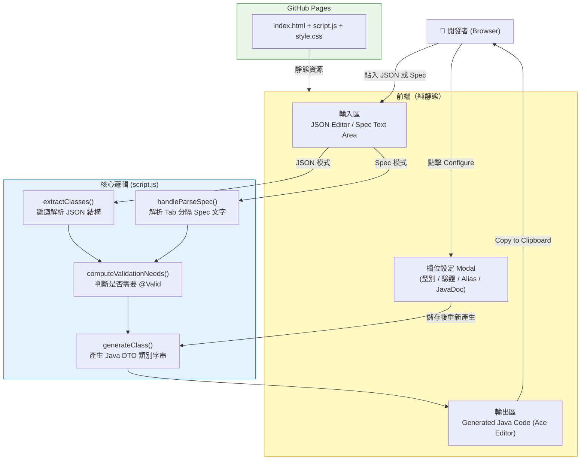
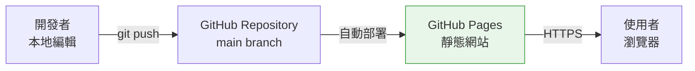

# Spring Boot DTO Generator

> 一款純前端工具，讓開發者只需貼入 JSON 或 API Spec 文件，即可自動產生符合 Spring Boot 規範的 Java DTO 類別，省去手刻樣板程式碼的時間。

---

## 一、專案概覽

### 背景與動機

在 Spring Boot 專案開發中，每個 API 都需要對應的 DTO（Data Transfer Object）類別，手工撰寫這些類別不只繁瑣，也容易與 API JSON 格式產生落差。本工具的目標是：

- 將 API 的 JSON 範例或規格書（Spec）直接轉換為可用的 Java DTO 程式碼
- 自動加入 `@JsonProperty`、`@NotNull`、`@Size` 等常用 annotation
- 支援 Lombok `@Data`、`Serializable`，以及 JavaDoc 欄位註解
- 讓開發者專注在業務邏輯，而非重複的類別定義

### 技術堆疊

| 層級         | 技術                                       |
| ------------ | ------------------------------------------ |
| 前端框架     | 原生 HTML / CSS / JavaScript（無框架依賴） |
| 樣式         | Tailwind CSS（CDN）                        |
| 程式碼編輯器 | Ace Editor（JSON / Java 語法高亮）         |
| 版本控制     | Git + GitHub                               |
| 部署         | GitHub Pages（靜態托管）                   |

---

## 二、系統架構圖



---

## 三、功能詳解

### 3.1 兩種輸入模式

工具提供 **JSON Input** 與 **Spec Text Input** 兩個 Tab：

**JSON Input 模式**

貼入 API 回傳的 JSON 範例，工具會自動：

1. 以 `extractClasses()` 遞迴走訪 JSON，辨識巢狀物件與陣列
2. 推斷每個欄位的 Java 型別（`String` / `Integer` / `Double` / `Boolean`）
3. 展示 JSON Structure Panel，讓使用者點擊 Configure 調整每個欄位的細節設定
4. 即時產生對應的 Java DTO 程式碼

**Spec Text Input 模式**

直接從 Word / Excel 規格書複製貼上（Tab 分隔），格式為：

```
Level  FieldName  Type  Length  Required(Y/空)  Description
```

工具以 `handleParseSpec()` 解析層級關係，支援多層巢狀結構與 `TRANRQ` / `TRANRS` 根節點自動判斷。

---

### 3.2 欄位設定（Configure Modal）

每個欄位都可以透過 Modal 進行個別設定：

| 設定項目   | 說明                                                                                                            |
| ---------- | --------------------------------------------------------------------------------------------------------------- |
| Field Type | 可選 String / Integer / Long / Double / Boolean / BigDecimal / LocalDate / LocalDateTime / Timestamp / 自訂型別 |
| Required   | 勾選後自動加入 `@NotBlank` / `@NotNull` / `@NotEmpty`（含中文錯誤訊息）                                         |
| Max Length | 字串加 `@Size`，數字型別加 `@Max`                                                                               |
| JsonAlias  | 加入 `@JsonAlias`，支援多個 alias（逗號分隔）                                                                   |
| Comment    | 欄位的 JavaDoc 行內註解                                                                                         |

---

### 3.3 Validation API 切換

支援 Spring Boot 版本的 import 路徑差異：

| 選項                 | 適用場景               | Import 路徑                        |
| -------------------- | ---------------------- | ---------------------------------- |
| Java EE (javax)      | Spring Boot 2.x 及以下 | `javax.validation.constraints.*`   |
| Jakarta EE (jakarta) | Spring Boot 3.x 及以上 | `jakarta.validation.constraints.*` |

此設定與 Java 語言版本（8 / 11 / 17 / 21）無關，專指 Spring Boot 框架的版本分界。

---

### 3.4 產生的 DTO 格式

工具輸出的 Java 類別範例如下：

```java
import com.fasterxml.jackson.annotation.JsonProperty;
import jakarta.validation.constraints.NotBlank;
import java.io.Serializable;
import lombok.Data;

@Data
public class DTOGENERQTranrqCaseList implements Serializable {

    /** serialVersionUID */
    private static final long serialVersionUID = 1L;

    /** 案件ID */
    @JsonProperty("caseId")
    @NotBlank(message="caseId 不得為空")
    private String caseId;

    @JsonProperty("caseType")
    private String caseType;

    @JsonProperty("flows")
    @Valid
    private DTOGENERQTranrqCaseListFlows flows;
}
```

---

## 四、核心演算法說明

### `extractClasses(obj, rootName)` — JSON 解析

遞迴走訪 JSON 物件，對每個 key-value 判斷：

- **純值（string / number / boolean）** → 推斷為 `String` / `Integer` / `Double` / `Boolean`
- **巢狀物件** → 建立新的子 class，命名規則為 `父ClassName + capitalize(key)`
- **陣列（含物件元素）** → 型別為 `List<子ClassName>`，取第一個元素繼續遞迴解析；若陣列元素為純值則為 `List<String>`

### `computeValidationNeeds(classes)` — @Valid 傳播

遞迴判斷一個 class 本身或其任何子 class 是否有驗證設定，若有則在父 class 的對應欄位加上 `@Valid`，確保巢狀驗證能正確觸發。

### `handleParseSpec(e)` — Spec 文字解析

1. **預處理**：合併從 Word / Excel 複製時因換行被切斷的欄位名稱
2. **階層解析**：依 Level 欄位建立 `levelToClass` 對照表，逐行確定父子關係
3. **型別正規化**：統一大小寫（`integer` → `Integer`）、處理 `List<Object>` 與 `List<primitive>`
4. **產生**：呼叫 `generateSpecClass()` 輸出每個 class 的 Java 程式碼

---

## 五、部署架構



專案採純靜態架構（`index.html` + `script.js` + `style.css`），直接部署於 GitHub Pages：

- 無需伺服器
- 無後端 API
- 所有邏輯在瀏覽器端執行，JSON 資料不會離開本機

---

## 六、Git Branch 結構

| Branch       | 說明                            |
| ------------ | ------------------------------- |
| `main`       | 穩定版本，對應線上部署          |
| `senior-dev` | 進階功能開發分支                |
| `codex/*`    | AI 協作產生的功能分支（已合併） |

---

## 七、已知限制

- JSON 模式的型別推斷基於範例值，如範例值為 `"123"` 會推斷為 String 而非 Integer，需手動透過 Configure 調整
- Spec 模式依賴 Tab 分隔格式，若來源文件使用空格分隔則需先調整
- 不支援 `enum` 型別的自動產生
- 巢狀陣列（Array of Array）目前不在支援範圍內

---

*最後更新：2026-04-08*
