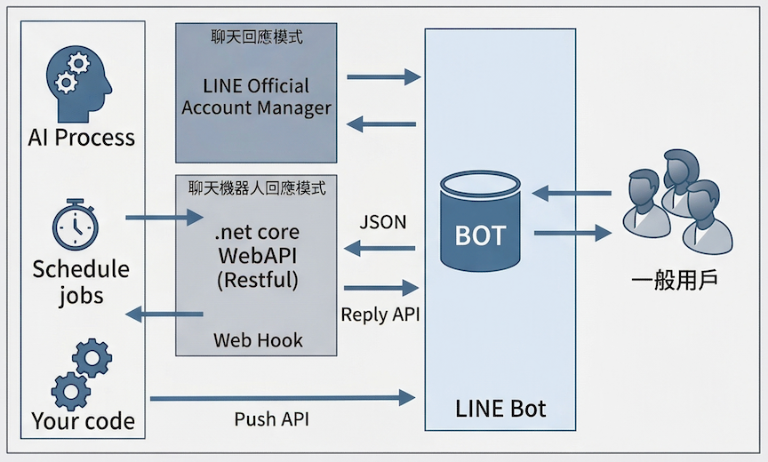

# OpenAI API 對談機器人與 Agent 開發實戰

**課程名稱**：對談機器人與 AI Agent 開發實戰—使用 OpenAI API

**課程日期**：2026/3/10、2026/3/17（共兩天）

**授課講師**：David Dong（isRock）

本次外訓的主軸是「如何用 .NET 串接 OpenAI API，從最基礎的 API 呼叫一路進展到具備自主決策能力的 AI Agent 架構」。課程以動手實作為主，幾乎每個段落都有對應的 Lab，以下依課程推進的脈絡依序整理重點，並附上個人對內部落地可行性的初步觀察。

---

## 1. OpenAI API 基礎：從呼叫到多輪對話

課程前段以 Postman 直接呼叫 OpenAI REST API 為暖身，涵蓋三個端點：

- **Completions API**（`/v1/completions`）：較舊的補完型介面，適合單次提示產生文字。
- **Image Generations API**（`/v1/images/generations`）：依文字描述產生圖片，課程以 DALL-E 模型示範。
- **Chat Completions API**（`/v1/chat/completions`）：現行主流的對話介面，採 `messages` 陣列格式傳入完整對話脈絡。

其中 Chat Completions API 的設計有一個重要的特性：**模型本身是無狀態的（Stateless）**，每次呼叫彼此獨立，「記憶」必須由呼叫端在請求中帶入歷史訊息。課程透過一個簡單的實驗說明了這個問題——先問「台灣最大的城市是哪裡」，再問「最南端的城市是哪裡」，若沒有攜帶上輪紀錄，模型無從得知第二個問題的上下文，答案便可能產生偏差。這個設計細節在後續的記憶管理章節有進一步處理。

---

## 2. 建立 LINE Bot 並串接 OpenAI

課程以 .NET 8 WebAPI（搭配 `linebotsdk` 套件）為基底，實作 LINE Messaging API 的 Webhook，並於其中呼叫 OpenAI Chat Completions API。

整體流程如下：使用者在 LINE 傳送訊息 → LINE 將事件 POST 到我們部署的 Webhook → .NET 應用程式解析訊息內容 → 呼叫 OpenAI API 取得回覆 → 透過 LINE Reply Token 回傳給使用者。



本地開發時，為了讓 LINE 的伺服器能夠打到本機，課程使用 **DevTunnel**（Microsoft 提供的 Tunnel 工具）將 `localhost` 公開至外部網路。這個環節在實務上是常見的卡關點，課程有提供設定教學。

在 System Prompt 的設計上，課程也演示了一個「餐飲客服機器人」的範例，說明如何將企業自有資料（菜單、價格、優惠規則）直接嵌入 Prompt 中，讓模型在作答時遵循特定知識範疇，不超出既定邊界。這是最直接的「企業知識注入」方式，雖然不如 RAG 系統化，但在資料量不大、更新頻率低的情境下仍屬可行。

---

## 3. 對話記憶管理：ChatHistoryManager 的實作模式

為了讓 Chatbot 具備跨輪次的記憶，課程在 .NET 層實作了一個 `ChatHistoryManager`，以使用者的 LINE UserID 為索引，將每輪的對話（使用者訊息 + AI 回覆）序列化後存入 `IsolatedStorage`。

每次使用者傳入新訊息時，程式會先從儲存空間撈出該使用者的歷史紀錄，整理成 `messages` 陣列後一併帶入 API 請求，讓模型能看見完整的對話脈絡。此外，課程也設計了 `/reset` 指令，讓使用者可以主動清除歷史，開始全新對話。

這個實作方式在原型階段相當直觀，但投入正式環境前有一些值得評估的點：`IsolatedStorage` 的方式並不適合多實例部署（橫向擴展時資料不共享），正式環境應替換為資料庫或 Redis 等集中式儲存；同時，歷史訊息隨使用次數增長，若不加以控制，Token 消耗會線性成長，課程有提到需要設計收斂策略（例如保留最近 N 輪，或定期摘要），但實際的收斂邏輯需視產品需求自行設計。

---

## 4. 語意理解：Azure AI CLU（Conversational Language Understanding）

課程介紹了 Azure AI 的 **CLU（Conversational Language Understanding）** 服務，用於在正式呼叫 LLM 之前，先以較輕量的模型對使用者輸入進行意圖分類（Intent Classification）與實體擷取（Entity Extraction）。

實作流程是在 Azure Language Studio 中建立專案，手動標注語料（例如將「我要點一份燒餅油條」標為「點餐行為」，將「叫你老闆出來」標為「客訴」），訓練後部署為 REST API，再透過 Postman 驗證辨識結果。

這套做法的核心邏輯是**分層處理**：對於意圖明確、答案規則性強的請求（如特定分類的查詢），不需要也不應該每次都動用成本較高的 GPT-4 等大型模型；由 CLU 先行分派，在降低成本的同時也能加快反應速度。對於我們在金融環境下對成本與延遲都有一定敏感度的需求，這個概念值得參考。

---

## 5. 問答知識庫：Azure AI Question Answering

課程以 Azure AI 的 **Custom Question Answering** 服務為例，演示如何將既有的文件（PDF、網頁、Word）轉換成可被查詢的 Q&A 知識庫。使用者輸入問題後，系統會在知識庫中匹配最相關的答案段落，直接回傳，而非讓模型自行生成。

這與後段介紹的 RAG 概念有所關聯，但實作層次不同：Question Answering 服務屬於較封閉的 SaaS 型工具，設定簡單；RAG 則是在向量資料庫之上自行組裝的開放架構，彈性更高，也需要更多工程投入。

---

## 6. Function Calling 與強制 JSON 輸出

這個段落處理了一個在實際應用中很常遇到的問題：如何確保 LLM 的回覆是可程式解析的結構化格式，而非自由形式的文字。課程介紹了兩種方式：

**Function Calling**：在請求中定義一組 `functions` 物件，描述函式的名稱、參數與用途。當使用者的輸入符合某個函式的觸發情境時，模型會以 JSON 格式回傳函式名稱與對應的參數值，由應用程式端接收後自行執行實際邏輯。這是目前業界實作 AI Agent「工具呼叫」能力的主流機制。

**JSON Mode**：透過在請求中加入 `"response_format": {"type": "json_object"}`，強制要求模型的回覆一律為合法 JSON，適用於希望讓模型自行組織結構的場景，但對輸出欄位的控制能力不如 Function Calling 精確。

課程以「請假助理」為情境串接了這兩種技術：使用者以自然語言輸入請假需求（例如「我想從下週一請三天病假，代理人是 Eric」），系統逐輪蒐集缺失資訊，最終透過 Function Calling 產出完整的 JSON 請假單。這個流程本身可以很直接地對應到我們內部的業務申請情境。

---

## 7. Semantic Kernel 與 Plugin 架構

課程後段引入了 Microsoft 的 **Semantic Kernel（SK）** SDK。SK 是一個開源的 AI 整合框架，核心概念是將應用程式的各種功能封裝成「Plugin（外掛）」，以 attribute 標記後讓 LLM 自動識別並按需呼叫，減少手動管理 Function Calling JSON 定義的樣板程式碼。

以課程的請假情境為例，Plugin 看起來像這樣：

```csharp
[KernelFunction]
[Description("進行請假")]
public bool LeaveRequest(
    [Description("請假起始日期")] DateTime startDate,
    [Description("請假天數")] string days,
    [Description("請假者姓名")] string employeeName)
{
    // 實際業務邏輯
}
```

SK 負責將這些方法的描述自動轉換成 LLM 能理解的 Schema，並在對話中按需觸發。相較於直接操作原始 API，SK 確實降低了工程複雜度，對需要同時管理多個工具的 Agent 場景效益較明顯。

---

## 8. MCP（Model Context Protocol）架構

課程末段介紹了 **MCP（Model Context Protocol）**，這是 Anthropic 提出、目前逐漸成為業界標準的 AI 工具整合協議，旨在讓 AI 模型（即 MCP Client，如 GitHub Copilot）能以統一的協議連接外部工具和服務（即 MCP Server）。

課程以 .NET 實作了一個請假工具的 MCP Server，並透過 VS Code 的 `.vscode/mcp.json` 設定檔，讓 GitHub Copilot 在 Agent Mode 下能夠直接呼叫這個本地工具。開發者在 Copilot 的對話框輸入自然語言請求，Copilot 便會自主判斷是否需要呼叫 MCP Server 上的工具函式。

MCP 的架構意義在於**解耦 AI 模型與工具實作**：工具以獨立服務的形式存在，任何支援 MCP 的 AI 客戶端皆可呼叫，不需要與特定模型綁定。這與目前部門正在評估的 MCP Server 方向有一定的呼應，也可作為後續工具鏈標準化的參考依據。

---

## 9. RAG（Retrieval-Augmented Generation）與向量資料庫

最後一個技術段落介紹了 **RAG 架構**的概念與基礎實作。

在沒有 RAG 的情況下，若要讓模型回答企業內部知識，只能將知識直接寫入 Prompt（如前述餐廳菜單的做法），這在知識量大、更新頻繁時不具可擴展性。RAG 的做法是：預先將文件切片並轉換成向量嵌入（Embedding），存入向量資料庫（課程示範使用 Qdrant，以 Docker 本地部署）；使用者提問時，系統先在向量資料庫中做語意相似度搜尋，找出最相關的段落，再將這些段落作為上下文（Context）注入 Prompt，讓模型基於「確切的來源資料」生成回覆，而非靠自身的訓練參數臆測。

這個架構對於金融業的場景尤其值得關注：RAG 能有效壓制模型「幻覺（Hallucination）」的問題，讓回答有明確的來源段落可供追溯，在合規與可解釋性上有較好的支撐。當然，RAG 並非萬靈丹，其效果高度依賴文件切片策略、Embedding 模型的選擇以及檢索的精準度，這些都需要針對實際資料進行調校。

---

## 10. 整體觀察與對內部應用的初步評估

### 技術可行性

課程涵蓋的技術棧（.NET + OpenAI API / Azure OpenAI + MCP）與部門現有的技術方向有相當高的重疊度，學習曲線相對可控。Azure OpenAI 的版本在 API 使用上與 OpenAI 原生差異不大，主要差異在 endpoint 格式與認證方式，切換成本低。

### 應用場景方向

就目前課程所見的技術範疇，個人初步認為以下幾個方向較具評估價值：

第一是**結構化資訊擷取**。以 Function Calling 驅動自然語言表單填寫（如請假、簽核申請），讓使用者以口語輸入，系統補全缺失欄位後產出符合 API 規格的 JSON，再銜接既有的後端流程。這個模式技術難度適中，且與現有的業務系統整合路徑明確。

第二是**內部知識查詢**。以 RAG 架構串接內部技術文件或 SOP，提供開發或維運人員語意化的查詢介面。這個方向的主要工程成本在文件的向量化前處理與索引維護，模型部分反而相對標準化。

第三是**MCP 工具鏈標準化**。若後續評估要讓 GitHub Copilot 或其他 AI 助手能呼叫內部 API，MCP Server 的架構可作為統一的工具接口標準，避免各工具分散整合的維護成本。

### 需要進一步評估的點

記憶體儲方案（IsolatedStorage → Redis/DB）的選型與部署環境的兼容性、RAG 文件切片與向量化的 pipeline 設計、以及與現有合規框架的對齊，這些部分在課程中屬於概念層次的介紹，若要進入 PoC 階段，需要針對實際環境作更細緻的評估，以上為個人目前的初步判斷，供參考。

---

## 課堂實作

- LINE Bot 範例（.NET 8 + OpenAI）：https://github.com/little-air-1019/line-bot-with-openai
- 含歷史記憶的 LINE Bot ：https://github.com/little-air-1019/testhistory
- MCP Server ：https://github.com/little-air-1019/LeaveRequestMcpServer
- Semantic Kernel ：https://github.com/little-air-1019/semantic-kernel
- 向量資料庫（Qdrant）參考：https://studyhost.blogspot.com/2024/04/qdrant.html